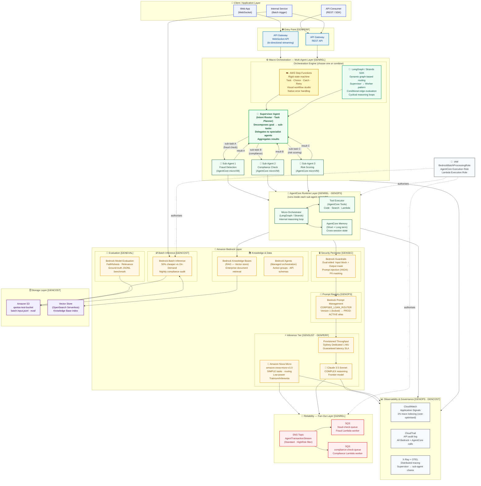

# AWS Bedrock + AgentCore — Reference Architecture

> **Region:** `ap-southeast-2` (Sydney) · **Framework:** CORPSEE GenAI Well-Architected

---

## Architecture Diagram



---

## Component Reference

### 👤 Client / Application Layer

| Component | Purpose |
|-----------|---------|
| **Web App (WebSocket)** | Browser UI — receives token-by-token streamed responses via API Gateway WebSocket. Latency feels < 200 ms to the end user. |
| **API Consumer (REST)** | Backend services or third-party integrations invoking the agent pipeline synchronously. |
| **Internal Service (Batch trigger)** | Scheduled jobs (EventBridge, Lambda) that submit nightly bulk payloads to Bedrock Batch Inference. |

---

### 🌐 Entry Point — API Gateway `[GENPERF]`

| Component | Purpose |
|-----------|---------|
| **API Gateway WebSocket API** | Maintains a persistent bi-directional connection per client. The Lambda handler calls `bedrock-runtime.converse_stream` and pushes each token chunk via `post_to_connection`. Eliminates synchronous request-response bottlenecks. |
| **API Gateway REST API** | Standard HTTP entry-point for synchronous or fire-and-forget batch trigger calls. |

---

### ⚙️ Macro Orchestration — Multi-Agent Layer `[GENREL]`

This layer answers the architect question: **where does multi-agent orchestration happen?**

Multi-agent coordination occurs at the **Macro Orchestration layer**, sitting above the individual AgentCore Runtime VMs. A **Supervisor Agent** decomposes a complex goal into discrete sub-tasks and delegates each to a specialist sub-agent running in its own isolated microVM. Results are aggregated back at the supervisor before returning to the client.

Two orchestration engines are supported — choose one or combine them:

#### Option A — AWS Step Functions (Rigid Workflows)

Best for: **deterministic, auditable, compliance-driven** multi-agent pipelines where every transition must be explicitly defined and retried on failure.

| State type | Role in multi-agent flow |
|------------|--------------------------|
| **Task** | Invokes a Bedrock Agent or Lambda that wraps a sub-agent |
| **Choice** | Routes to different specialist agents based on intent classification result |
| **Parallel** | Fans out to multiple sub-agents simultaneously (fraud + compliance + risk in parallel) |
| **Catch** | Intercepts `ThrottlingException` / `503` on any sub-agent — redirects to fallback without failing the whole workflow |
| **Map** | Iterates over a list of records, sending each to a sub-agent — ideal for bulk processing |
| **Succeed / Fail** | Terminal states after supervisor aggregation |

> See [`AWS_Step_StateDiagram.md`](AWS_Step_StateDiagram.md) for the full state machine diagram.

#### Option B — LangGraph / Strands SDK (Dynamic Graph Routing)

Best for: **non-deterministic, reasoning-heavy** multi-agent workflows where the routing decision depends on intermediate outputs and cannot be fully pre-defined.

| Concept | Role in multi-agent flow |
|---------|--------------------------|
| **Supervisor node** | Central planning agent — receives the goal, calls a lightweight classifier (Nova Micro), decides which specialist sub-agents to invoke and in what order |
| **Worker nodes** | Specialist sub-agents (fraud, compliance, risk) — each runs inside its own AgentCore microVM, receives a scoped sub-task, returns a structured result |
| **Conditional edges** | LangGraph routes the graph traversal based on the supervisor's evaluation of prior node outputs — supports loops, retries, and branching |
| **Strands SDK** | AWS-native agent framework — wraps tool definitions, memory access, and AgentCore harness invocations with minimal boilerplate |
| **`END` node** | Supervisor aggregates all sub-agent results and produces the final unified response |

> See [`LanggraphGraphDiagram.md`](LanggraphGraphDiagram.md) for the graph state diagram.

#### Supervisor → Sub-Agent Pattern

```
                   ┌─────────────────────────────────────┐
    Client Query ──► Supervisor Agent                     │
                   │  (Intent Router · Task Planner)      │
                   │  Decomposes goal → sub-tasks          │
                   └──────┬──────────┬──────────┬─────────┘
                          │          │          │
                 sub-task A     sub-task B   sub-task C
                          │          │          │
                          ▼          ▼          ▼
                   ┌──────────┐ ┌──────────┐ ┌──────────┐
                   │Sub-Agent1│ │Sub-Agent2│ │Sub-Agent3│
                   │  Fraud   │ │Compliance│ │  Risk    │
                   │(microVM) │ │(microVM) │ │(microVM) │
                   └────┬─────┘ └────┬─────┘ └────┬─────┘
                        │            │             │
                   result A      result B       result C
                        │            │             │
                        └────────────┴─────────────┘
                                     │
                              ┌──────▼──────┐
                              │  Supervisor │
                              │  Aggregate  │
                              └──────┬──────┘
                                     │
                                  Response
```

**Key design principle — Macro vs Micro orchestration:**

| Layer | Scope | Tools |
|-------|-------|-------|
| **Macro** (this layer) | Coordinates *between* agents — task decomposition, delegation, aggregation, circuit-breaking | Step Functions · LangGraph · Strands |
| **Micro** (inside each agent) | Controls the *within-agent* reasoning loop — planning, tool calls, memory reads | LangGraph nodes · Strands tools · AgentCore Runtime |

---

### 🤖 AgentCore Runtime Layer `[GENREL · GENOPS]`

**AWS AgentCore Runtime** provides **secure, isolated micro-VM containers** for each sub-agent — up to **8 hours** per execution. Every sub-agent in the multi-agent network runs in its own VM with no shared state.

| Component | Purpose |
|-----------|---------|
| **AgentCore Runtime (micro-VM)** | Isolated execution environment per sub-agent. Each gets its own VM — no cross-tenant or cross-agent state leakage. Supports LangGraph, Strands SDK, and custom frameworks. |
| **Micro-Orchestrator (LangGraph / Strands)** | The *within-agent* reasoning loop — plans tool calls, evaluates results, decides next steps. This is distinct from the macro-level supervisor. |
| **AgentCore Tools** | Managed tool execution — code interpreter, web search, custom Lambda actions, API integrations. Invoked by the micro-orchestrator during the reasoning loop. |
| **AgentCore Memory (Short + Long term)** | Persistent cross-session memory. Short-term: current session context. Long-term: user preferences and prior results — re-injected automatically on next invocation. |

---

### 🧠 Amazon Bedrock Layer

#### 🔒 Security Perimeter — Bedrock Guardrails `[GENSEC]`

**Bedrock Guardrails** enforces a **dual-sided security perimeter** — every request passes through the guardrail *before* inference (input scan) and every response passes through *after* inference (output scan). Applies to both the supervisor agent and all sub-agents. All compute stays within the Sydney data centre boundary.

| Filter | Setting | Effect |
|--------|---------|--------|
| **Prompt Attack** | Input: HIGH / Output: NONE | Blocks indirect prompt injection and jailbreak attempts before they reach the model |
| **PII — Email** | Block | Redacts email addresses from both input and output |
| **PII — IP Address** | Anonymise | Replaces IP addresses with a masked token |
| **Blocked input message** | `⛔ Input blocked by CORPSEE security perimeter.` | Returned to client when guardrail intervenes |

#### 📝 Prompt Registry — Bedrock Prompt Management `[GENOPS]`

Implements the **Open-Closed Principle** for AI systems: the inference code is *closed to modification* (it always targets a stable alias ARN), while prompts are *open for extension* via version bumps.

| Concept | Implementation |
|---------|---------------|
| **Prompt template** | `CORPSEE_LOAN_ROUTER` — contains `{{user_query}}` and `{{account_id}}` tokens |
| **Version lock** | Version 1 is immutable. Changes require a new version number. |
| **PROD-ACTIVE alias** | Points to a specific locked version. Promote by re-mapping the alias — zero-downtime swap. |
| **Runtime hydration** | Core code calls `get_prompt(promptIdentifier=ALIAS_ARN)` then replaces `{{tokens}}` at runtime |

#### ⚡ Inference Tier `[GENSUST · GENPERF]`

| Model | ID | Use case | Energy track |
|-------|----|----------|--------------|
| **Amazon Nova Micro** | `amazon.nova-micro-v1:0` | Intent classification, task routing, SIMPLE sub-task responses | 🍃 Low-power — runs on AWS Trainium/Inferentia chips |
| **Claude 3.5 Sonnet** | `anthropic.claude-3-5-sonnet-20241022-v2:0` | COMPLEX reasoning, risk analysis, deep synthesis by specialist sub-agents | 🚀 Frontier model — only invoked when necessary |
| **Provisioned Throughput** | Sydney Dedicated 1 MU | Production inference with guaranteed latency SLA for the supervisor agent | Eliminates noisy-neighbour quota sharing |

#### 📚 Knowledge & Data

| Component | Purpose |
|-----------|---------|
| **Bedrock Knowledge Bases** | RAG (Retrieval-Augmented Generation) — each sub-agent can independently query enterprise document repositories scoped to its domain (e.g., fraud KB vs compliance KB). |
| **Bedrock Agents** | Managed agent service for simpler orchestration patterns — action groups, API schemas, and Lambda integrations without bringing your own framework. |

#### 🪙 Batch Inference `[GENCOST]`

| Property | Value |
|----------|-------|
| **API** | `bedrock.create_model_invocation_job()` |
| **Discount** | **50 % cheaper** than synchronous On-Demand per-token pricing |
| **Input format** | JSONL manifest on S3 (`s3://qantas-test-bucket/corpss-demo/batch-input.jsonl`) |
| **Output** | Written back to S3 (`corpss-demo/batch-output/`) |
| **Use case** | Nightly compliance bulk audit — processes hundreds of loan records overnight |
| **IAM role** | `BedrockBatchProcessingRole` — scoped to S3 bucket and Bedrock model access |

#### 🧪 Evaluation `[GENEVAL]`

| Property | Value |
|----------|-------|
| **API** | `bedrock.create_evaluation_job()` |
| **Metrics** | Faithfulness (groundedness) · Answer Relevance · Context Relevance · Coherence |
| **Input** | S3 gold-standard JSONL ground-truth dataset |
| **Runtime eval** | `invoke_agent(enableTrace=True)` — parses RAG sources, rationale, tool call accuracy live |
| **5-step loop** | Ground Truth → Offline Eval → Safe Deploy → Online Monitor → Continuous Improvement |

---

### 📡 Reliability — Fan-Out Layer `[GENREL]`

**Blast Radius Isolation Pattern**: a single transaction event is published to SNS once, and N independent SQS queues each receive their own copy simultaneously. Complements the multi-agent supervisor pattern — if the compliance worker Lambda crashes, the fraud worker continues unaffected.

| Resource | Consumer |
|----------|---------|
| **AgentTransactionStream** (SNS) | Publisher: supervisor agent after aggregation |
| **corpss-fraud-check-queue** (SQS) | Fraud detection Lambda (`WORKER_TYPE=fraud`) |
| **corpss-compliance-check-queue** (SQS) | Regulatory compliance Lambda (`WORKER_TYPE=compliance`) |

**Message attributes** allow selective filtering — only `TransactionTier=HighRisk` messages trigger the fraud worker.

---

### 🗄️ Storage Layer `[GENCOST]`

| Resource | Purpose |
|----------|---------|
| **Amazon S3** (`qantas-test-bucket`) | Batch input manifests (JSONL), batch output results, evaluation ground-truth datasets, raw document ingestion for Knowledge Bases |
| **OpenSearch Serverless** (Vector Store) | Managed vector index backing Bedrock Knowledge Bases — stores document embeddings for semantic retrieval by sub-agents |

---

### 📊 Observability & Governance `[GENOPS · GENCOST]`

| Service | Configuration | Purpose |
|---------|--------------|---------|
| **CloudWatch Application Signals** | Trace indexing: **1 %** | Full observability at 1/100th the cost — captures representative samples without logging every token |
| **CloudTrail** | All regions | Immutable audit log of every Bedrock API call — who invoked which model, when |
| **X-Ray + OpenTelemetry (OTEL)** | Distributed tracing | End-to-end call chain visibility across **Supervisor → Sub-Agent 1/2/3 → Bedrock → SNS/SQS** — critical for debugging multi-agent reasoning chains |

---

### 🔑 IAM Roles

| Role | Trust Principal | Permissions |
|------|----------------|-------------|
| `BedrockBatchProcessingRole` | `bedrock.amazonaws.com` | `AmazonBedrockFullAccess` + S3 read/write on `qantas-test-bucket` |
| `AgentCoreExecutionRole` | `agentcore.amazonaws.com` | Bedrock invoke, SQS send, S3 read, CloudWatch logs |
| `LambdaWorkerRole` | `lambda.amazonaws.com` | SQS receive/delete, Bedrock runtime invoke, CloudWatch logs |

---

## CORPSEE Pillar Mapping

| Pillar | Code | Primary AWS Services |
|--------|------|---------------------|
| **C** Cost Optimisation | `GENCOST` | Bedrock Batch Inference · Prompt Caching · S3 · CloudWatch (1% sampling) |
| **O** Operational Excellence | `GENOPS` | Bedrock Prompt Management · Prompt Aliases · OTEL Observability |
| **R** Reliability | `GENREL` | Step Functions · LangGraph/Strands · AgentCore Runtime · SNS · SQS · Circuit Breaker |
| **P** Performance Efficiency | `GENPERF` | API Gateway WebSocket · AgentCore Harness · Bedrock Provisioned Throughput |
| **S** Security | `GENSEC` | Bedrock Guardrails · AgentCore microVM Isolation · IAM |
| **E** Evaluation & Trust | `GENEVAL` | Bedrock Model Evaluation · AgentCore Trace · Ground-truth benchmarks |
| **E** Sustainability | `GENSUST` | Amazon Nova Micro (Trainium/Inferentia) · Right-sized model routing |
