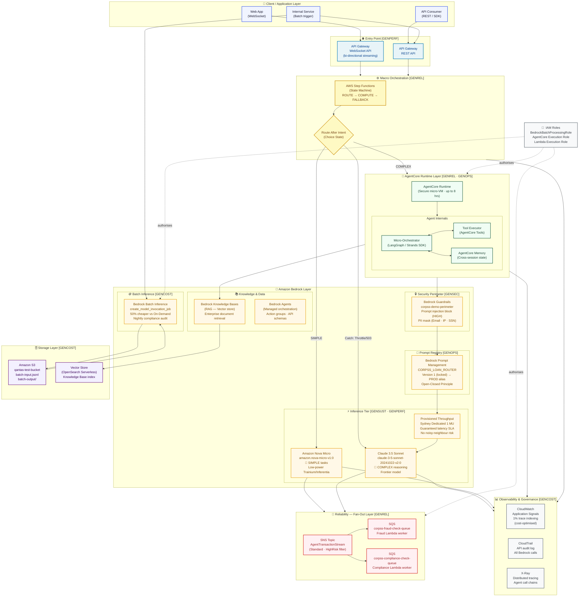

# AWS Bedrock + AgentCore — Reference Architecture

> **Region:** `ap-southeast-2` (Sydney) · **Framework:** CORPSS GenAI Well-Architected

---

## Architecture Diagram

---

## Component Reference

### 👤 Client / Application Layer

| Component | Purpose |
|-----------|---------|
| **Web App (WebSocket)** | Browser UI — receives token-by-token streamed responses via API Gateway WebSocket. Latency feels < 200 ms to the end user. |
| **API Consumer (REST)** | Backend services or third-party integrations invoking the agent pipeline synchronously. |
| **Internal Service (Batch trigger)** | Scheduled jobs (EventBridge, Lambda) that submit nightly bulk payloads to Bedrock Batch Inference. |

---

### 🌐 Entry Point — API Gateway `[GENPERF]`

| Component | Purpose |
|-----------|---------|
| **API Gateway WebSocket API** | Maintains a persistent bi-directional connection per client. The Lambda handler calls `bedrock-runtime.converse_stream` and pushes each token chunk via `post_to_connection`. Eliminates synchronous request-response bottlenecks. |
| **API Gateway REST API** | Standard HTTP entry-point for synchronous or fire-and-forget batch trigger calls. |

---

### ⚙️ Macro Orchestration — AWS Step Functions `[GENREL]`

**AWS Step Functions** provides the **rigid macro-level state machine** that governs the entire transaction lifecycle. Unlike an agent's internal reasoning loop (micro-orchestration), Step Functions handles the *workflow skeleton*: routing, error catching, retries, and terminal states.

| State | Type | Role |
|-------|------|------|
| **Intent Router Node** | Task | Invokes Nova Micro to classify intent as `SIMPLE` or `COMPLEX` |
| **Route After Intent** | Choice | Branches on `$.complexity` — `SIMPLE` → Nova Micro direct, `COMPLEX` → AgentCore |
| **Primary Provisioned Node** | Task | Runs inference against Provisioned Throughput |
| **Route After Primary** | Choice | Branches on `$.use_fallback` |
| **Fallback Serverless Node** | Task | Catches `ThrottlingException` / `503` — fails over to On-Demand Claude 3.5 Sonnet |
| **Payload Extraction** | Succeed | Terminal state — extracts and returns final payload |

> See [`AWS_Step_StateDiagram.md`](AWS_Step_StateDiagram.md) for the full state machine diagram.

---

### 🤖 AgentCore Runtime Layer `[GENREL · GENOPS]`

**AWS AgentCore Runtime** provides **secure, isolated micro-VM containers** for running long-lived agent processes — up to **8 hours** per execution. This eliminates Lambda's 15-minute timeout constraint for complex multi-step reasoning workflows.

| Component | Purpose |
|-----------|---------|
| **AgentCore Runtime (micro-VM)** | Isolated execution environment. Each agent invocation gets its own VM — no shared state between customers, no noisy-neighbour risk. Supports LangGraph, Strands SDK, and custom frameworks. |
| **Micro-Orchestrator (LangGraph / Strands)** | The agent's internal reasoning loop — plans, calls tools, evaluates results, and decides next steps. Runs inside the AgentCore VM. |
| **AgentCore Tools** | Managed tool execution — code interpreter, web search, custom Lambda actions, API call integrations. Invoked by the orchestrator during the reasoning loop. |
| **AgentCore Memory** | Persistent cross-session memory store. Agents remember prior context, user preferences, and intermediate results across separate invocations. |

> See [`LanggraphGraphDiagram.md`](LanggraphGraphDiagram.md) for the micro-orchestration state diagram.

---

### 🧠 Amazon Bedrock Layer

#### 🔒 Security Perimeter — Bedrock Guardrails `[GENSEC]`

**Bedrock Guardrails** enforces a **dual-sided security perimeter** — every request passes through the guardrail *before* inference (input scan) and every response passes through *after* inference (output scan). All compute stays within the Sydney data centre boundary to satisfy AU data sovereignty requirements.

| Filter | Setting | Effect |
|--------|---------|--------|
| **Prompt Attack** | Input: HIGH / Output: NONE | Blocks indirect prompt injection and jailbreak attempts before they reach the model |
| **PII — Email** | Block | Redacts email addresses from both input and output |
| **PII — IP Address** | Anonymise | Replaces IP addresses with a masked token |
| **Blocked input message** | `⛔ Input blocked by CORPSS security perimeter.` | Returned to client when guardrail intervenes |

#### 📝 Prompt Registry — Bedrock Prompt Management `[GENOPS]`

Implements the **Open-Closed Principle** for AI systems: the inference code is *closed to modification* (it always targets a stable alias ARN), while prompts are *open for extension* via version bumps.

| Concept | Implementation |
|---------|---------------|
| **Prompt template** | `CORPSS_LOAN_ROUTER` — contains `{{user_query}}` and `{{account_id}}` tokens |
| **Version lock** | Version 1 is immutable. Changes require a new version number. |
| **PROD alias** | Points to a specific locked version. Promote a new version by re-mapping the alias — zero-downtime swap. |
| **Runtime hydration** | Core code calls `get_prompt(promptIdentifier=ALIAS_ARN)` then replaces `{{tokens}}` at runtime |

#### ⚡ Inference Tier `[GENSUST · GENPERF]`

| Model | ID | Use case | Energy track |
|-------|----|----------|--------------|
| **Amazon Nova Micro** | `amazon.nova-micro-v1:0` | Intent classification, SIMPLE query responses | 🍃 Low-power — runs on AWS Trainium/Inferentia chips |
| **Claude 3.5 Sonnet** | `anthropic.claude-3-5-sonnet-20241022-v2:0` | COMPLEX reasoning, risk analysis, deep synthesis | 🚀 Frontier model — only invoked when necessary |
| **Provisioned Throughput** | Sydney Dedicated 1 MU | Production inference with guaranteed latency SLA | Eliminates noisy-neighbour quota sharing |

#### 📚 Knowledge & Data

| Component | Purpose |
|-----------|---------|
| **Bedrock Knowledge Bases** | RAG (Retrieval-Augmented Generation) — connects agents to enterprise document repositories. Chunks, embeds, and indexes documents into a managed vector store. |
| **Bedrock Agents** | Managed agent service for simpler orchestration patterns — action groups, API schemas, and Lambda integrations without bringing your own framework. |

#### 🪙 Batch Inference `[GENCOST]`

| Property | Value |
|----------|-------|
| **API** | `bedrock.create_model_invocation_job()` |
| **Discount** | **50 % cheaper** than synchronous On-Demand per-token pricing |
| **Input format** | JSONL manifest on S3 (`s3://qantas-test-bucket/corpss-demo/batch-input.jsonl`) |
| **Output** | Written back to S3 (`corpss-demo/batch-output/`) |
| **Use case** | Nightly compliance bulk audit — processes hundreds of loan records overnight |
| **IAM role** | `BedrockBatchProcessingRole` — scoped to S3 bucket and Bedrock model access |

---

### 📡 Reliability — SNS + SQS Fan-Out `[GENREL]`

**Blast Radius Isolation Pattern**: a single transaction event is published to SNS once, and N independent SQS queues each receive their own copy simultaneously. If one worker queue or Lambda consumer crashes, all others continue completely unaffected.

| Resource | ARN suffix | Consumer |
|----------|-----------|---------|
| **AgentTransactionStream** (SNS) | `:AgentTransactionStream` | Publisher: agent pipeline |
| **corpss-fraud-check-queue** (SQS) | `/corpss-fraud-check-queue` | Fraud detection Lambda (`WORKER_TYPE=fraud`) |
| **corpss-compliance-check-queue** (SQS) | `/corpss-compliance-check-queue` | Regulatory compliance Lambda (`WORKER_TYPE=compliance`) |

**Message attributes** allow selective filtering — only `TransactionTier=HighRisk` messages trigger the fraud worker.

---

### 🗄️ Storage Layer `[GENCOST]`

| Resource | Purpose |
|----------|---------|
| **Amazon S3** (`qantas-test-bucket`) | Batch input manifests (JSONL), batch output results, raw document ingestion for Knowledge Bases |
| **OpenSearch Serverless** (Vector Store) | Managed vector index backing Bedrock Knowledge Bases — stores document embeddings for semantic retrieval |

---

### 📊 Observability & Governance `[GENCOST]`

| Service | Configuration | Purpose |
|---------|--------------|---------|
| **CloudWatch Application Signals** | Trace indexing: **1 %** | Full observability at 1/100th the cost — captures representative samples without logging every token |
| **CloudTrail** | All regions | Immutable audit log of every Bedrock API call — who invoked which model, when |
| **AWS X-Ray** | Distributed tracing | End-to-end call chain visibility across Step Functions → AgentCore → Bedrock → SNS/SQS |

---

### 🔑 IAM Roles

| Role | Trust Principal | Permissions |
|------|----------------|-------------|
| `BedrockBatchProcessingRole` | `bedrock.amazonaws.com` | `AmazonBedrockFullAccess` + S3 read/write on `qantas-test-bucket` |
| `AgentCoreExecutionRole` | `agentcore.amazonaws.com` | Bedrock invoke, SQS send, S3 read, CloudWatch logs |
| `LambdaWorkerRole` | `lambda.amazonaws.com` | SQS receive/delete, Bedrock runtime invoke, CloudWatch logs |

---

## CORPSS Pillar Mapping

| Pillar | Code | Primary AWS Services |
|--------|------|---------------------|
| **C** Cost Optimisation | `GENCOST` | Bedrock Batch Inference · S3 · CloudWatch (1% sampling) |
| **O** Operational Excellence | `GENOPS` | Bedrock Prompt Management · Prompt Aliases · Versioning |
| **R** Reliability | `GENREL` | Step Functions · AgentCore Runtime · SNS · SQS |
| **P** Performance Efficiency | `GENPERF` | API Gateway WebSocket · Bedrock Provisioned Throughput · `converse_stream` |
| **S** Security | `GENSEC` | Bedrock Guardrails · IAM · VPC (Sydney boundary) |
| **S** Sustainability | `GENSUST` | Amazon Nova Micro (Trainium/Inferentia) · Intelligent model routing |
